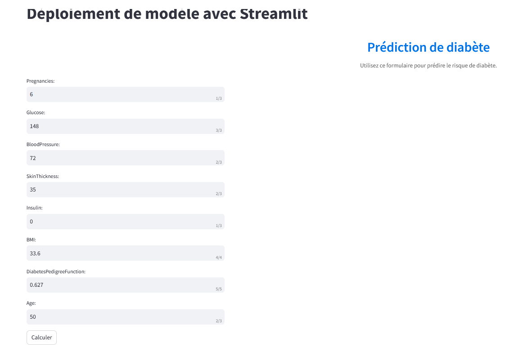

- # Déploiement de Modèle ML via STREAMLIT et DOCKER (Pycaret/PYTHON)

## Description du projet 
   Ce projet porte sur la prédiction du diabète en utilisant des variables explicatives telles que 'Grossesses', 'Glucose', 'Pression artérielle', 'Epaisseur de la peau', 'Insuline', 'Indice de masse corporelle (IMC)', 'Fonction de prédisposition au diabète' et 'Âge'. Le déploiement de modèles de machine learning via Streamlit et Docker offre une solution robuste et flexible pour déployer des modèles ML, en particulier avec l'utilisation de bibliothèques telles que Pycaret en Python. Cette approche combine la simplicité de Streamlit pour l'interface utilisateur avec la portabilité et la gestion efficace des conteneurs Docker, offrant ainsi un environnement stable et reproductible pour le déploiement d'applications ML.

   
   

